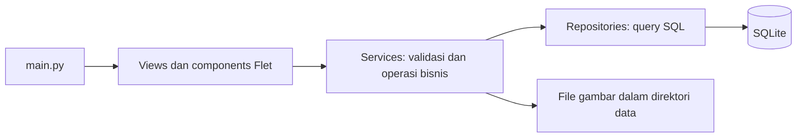

# DokumenUsaha

DokumenUsaha adalah aplikasi desktop Windows untuk administrasi usaha kecil di Indonesia. Aplikasi dikembangkan dengan Python, Flet, dan SQLite untuk penggunaan offline, satu pengguna, dan satu usaha per database.

Tujuan akhirnya adalah menghubungkan pelanggan, penawaran, invoice, pembayaran DP/cicilan, dan kwitansi. **Saat ini halaman yang tersedia adalah Profil Usaha dan Pelanggan.** Pengelolaan katalog sudah tersedia melalui service dan repository, tetapi belum memiliki halaman aplikasi.

Repository: [InsoniacX/ReceiptApp](https://github.com/InsoniacX/ReceiptApp).

## Daftar isi

- [Status implementasi](#status-implementasi)
- [Teknologi dan kebutuhan](#teknologi-dan-kebutuhan)
- [Instalasi dan menjalankan aplikasi](#instalasi-dan-menjalankan-aplikasi)
- [Penggunaan fitur](#penggunaan-fitur)
- [Struktur kode](#struktur-kode)
- [Arsitektur dan kontrak service](#arsitektur-dan-kontrak-service)
- [Database dan penyimpanan gambar](#database-dan-penyimpanan-gambar)
- [Pengujian](#pengujian)
- [Debugging dan pemecahan masalah](#debugging-dan-pemecahan-masalah)
- [Pengembangan berikutnya](#pengembangan-berikutnya)

## Status implementasi

Status berikut berdasarkan kode yang tersedia pada 18 September 2026. Keberadaan tabel database tidak berarti fitur tersebut sudah dapat digunakan melalui aplikasi.

| Bagian | Status | Kemampuan yang tersedia |
| --- | --- | --- |
| Fondasi database | Tersedia | Inisialisasi otomatis, migrasi dengan checksum, transaksi, constraint, index, dan trigger. |
| Profil usaha | Service, repository, dan UI tersedia | Membaca dan menyimpan identitas usaha, kontak, rekening, dan penanggung jawab. |
| Gambar usaha | Service dan UI tersedia | Memilih, menyimpan, dan memuat ulang logo, gambar QRIS, tanda tangan, dan stempel. |
| Pelanggan | Service, repository, dan UI tersedia | Tambah, edit, pencarian, arsip, aktivasi kembali, dan daftar 20 pelanggan per halaman. |
| Katalog produk/jasa | Service, repository, dan tes tersedia | Tambah, baca, pembaruan sebagian, pencarian, arsip, serta validasi harga dan SKU. UI belum tersedia. |
| Penawaran dan invoice | Schema dan pengujian aturan database tersedia | Tabel dokumen, item, snapshot, status, dan penguncian data; service serta UI belum tersedia. |
| Pembayaran dan kwitansi | Schema dan pengujian aturan database tersedia | Aturan pembayaran, pembatalan, kwitansi unik, serta saldo turunan; service serta UI belum tersedia. |
| Nomor dan riwayat dokumen | Fondasi database tersedia | Counter terpisah dan tabel riwayat; alur penerbitan melalui service belum tersedia. |
| PDF, cetak, dashboard, backup/restore | Belum tersedia | Masuk rencana pengembangan. |

Aplikasi belum menyediakan login, sinkronisasi cloud, payment gateway, kasir/POS, persediaan barang, atau akuntansi.

## Teknologi dan kebutuhan

Lingkungan pengembangan lokal menggunakan Windows, PowerShell, Python **3.12.2**, dan SQLite **3.43.1** bawaan Python. Gunakan Python 3.12 untuk mengikuti lingkungan ini; kompatibilitas versi Python lain belum didokumentasikan sebagai hasil pengujian.

| Komponen | Versi pada lingkungan/requirements | Peran |
| --- | --- | --- |
| Python | 3.12.2 | Bahasa aplikasi. |
| Flet | 0.86.5 | Antarmuka desktop dan pemilih file. |
| SQLite / `sqlite3` | 3.43.1 lokal | Penyimpanan data, transaksi, dan migrasi. |
| Pillow | 12.3.0 | Membaca dan memvalidasi gambar. |
| platformdirs | 4.11.8 | Menentukan direktori data pengguna. |
| pytest | 9.1.1 | Pengujian otomatis. |
| ReportLab | 5.0.1 | Dependensi yang disiapkan untuk PDF; modul PDF belum dibuat. |
| openpyxl | 3.1.5 | Dependensi yang disiapkan untuk Excel; fitur impor/ekspor belum dibuat. |

Daftar dependensi lengkap ada dalam `requirements.txt`. File tersebut merupakan snapshot lingkungan dan juga memuat paket web; aplikasi saat ini tidak memerlukan konfigurasi server web atau database terpisah. Instalasi dependensi dan penyiapan awal runtime desktop dapat membutuhkan internet.

## Instalasi dan menjalankan aplikasi

Semua perintah berikut dijalankan melalui PowerShell dari folder utama repository, yaitu folder yang memuat `main.py` dan `requirements.txt`.

### Instalasi baru

```powershell
git clone https://github.com/InsoniacX/ReceiptApp.git DokumenUsaha
Set-Location .\DokumenUsaha
py -3.12 -m venv venv
.\venv\Scripts\python.exe -m pip install -r requirements.txt
```

Jika repository dan `venv` sudah tersedia, gunakan lingkungan tersebut tanpa membuat ulang. Jika ingin mengikuti pekerjaan pada branch `development`, jalankan `git switch development` dari folder repository.

### Menjalankan aplikasi

```powershell
.\venv\Scripts\python.exe main.py
```

Pemanggilan interpreter secara langsung tidak membutuhkan aktivasi virtual environment. `main.py` menginisialisasi database, menerapkan migrasi yang belum dijalankan, lalu membangun halaman Profil Usaha dan Pelanggan. Log dan detail kesalahan ditampilkan di terminal.

### Inisialisasi database secara terpisah

Untuk lokasi data pengguna bawaan:

```powershell
.\venv\Scripts\python.exe -m app.database
```

Untuk database pengembangan terpisah:

```powershell
.\venv\Scripts\python.exe -m app.database --path .\data\dokumenusaha.db
```

**Opsi `--path` hanya berlaku untuk perintah inisialisasi tersebut.** Perintah ini tidak mengubah database yang digunakan `main.py`; aplikasi tetap memakai lokasi bawaan. Belum ada pemilih database di UI atau argumen lokasi database pada `main.py`.

## Penggunaan fitur

### Profil usaha dan gambar

1. Buka halaman **Profil Usaha**.
2. Isi nama usaha yang wajib tersedia. Lengkapi alamat, kontak, NPWP, penanggung jawab, serta rekening sesuai kebutuhan.
3. Klik **Simpan Profil** sebelum menambahkan gambar.
4. Gunakan **Pilih & Simpan Logo**, **Pilih & Simpan QRIS**, **Pilih & Simpan Tanda Tangan**, atau **Pilih & Simpan Stempel**.
5. Setiap tombol gambar langsung menyimpan gambar yang dipilih. Saat aplikasi dibuka ulang, gambar dimuat dari penyimpanan aplikasi.

Gambar harus berformat PNG atau JPEG, berukuran maksimal **5 MiB (5 × 1024 × 1024 byte)**, dan memiliki maksimal **16.000.000 piksel**. Pemeriksaan memakai isi gambar, bukan hanya ekstensi file. Gambar QRIS merupakan aset yang diunggah pengguna; aplikasi belum memproses atau mengonfirmasi pembayaran QRIS.

### Pelanggan

Halaman **Pelanggan** menyediakan pelanggan perorangan (`PERSONAL`) atau perusahaan (`COMPANY`). Nama pelanggan/kontak wajib diisi; tersedia pula nama perusahaan, alamat, telepon, WhatsApp, email, NPWP, dan catatan.

- Klik **Tambah Pelanggan** untuk membuat data baru atau **Edit** untuk memperbaruinya.
- Cari berdasarkan nama, perusahaan, telepon, atau WhatsApp, lalu klik **Cari** atau tekan Enter.
- Gunakan **Sebelumnya** dan **Berikutnya** untuk berpindah halaman.
- Klik **Arsipkan** untuk menonaktifkan pelanggan tanpa menghapus datanya.
- Centang **Sertakan pelanggan diarsipkan** untuk melihat arsip dan menggunakan **Aktifkan Kembali**.

### Katalog

Katalog belum muncul pada navigasi aplikasi. Fungsinya saat ini digunakan melalui `catalog_service` dan diuji melalui pytest. Data katalog meliputi SKU opsional, jenis `PRODUCT`/`SERVICE`, nama, deskripsi, harga default dalam Rupiah, satuan, dan status aktif.

## Struktur kode

```text
DokumenUsaha/
├── main.py                         # Titik masuk dan navigasi Flet
├── requirements.txt                # Snapshot dependensi
├── README.md                       # Panduan codebase saat ini
├── .gitignore                      # Pengecualian file lokal dari Git
├── app/
│   ├── config/
│   │   └── paths.py                # Lokasi database bawaan
│   ├── database/
│   │   ├── __init__.py             # Ekspor API database
│   │   ├── __main__.py             # CLI inisialisasi database
│   │   ├── database.py             # Koneksi, transaksi, dan migrasi
│   │   └── migrations/
│   │       └── 001_initial_schema.sql
│   ├── repositories/
│   │   ├── business_profile_repository.py
│   │   ├── customer_repository.py
│   │   └── catalog_repository.py
│   ├── services/
│   │   ├── business_profile_service.py
│   │   ├── business_image_service.py
│   │   ├── business_logo_service.py
│   │   ├── customer_service.py
│   │   └── catalog_service.py
│   ├── components/
│   │   ├── business_logo.py         # Pemilih dan pratinjau logo
│   │   └── business_image.py        # Pemilih QRIS/tanda tangan/stempel
│   └── views/
│       ├── business_profile_view.py
│       └── customer_view.py
└── tests/
    ├── test_database.py
    ├── test_business_profile.py
    ├── test_customer_service.py
    └── test_catalog_service.py
```

File `__init__.py` lain menandai paket Python. Folder `venv`, cache, database lokal, dan konfigurasi `.vscode` diabaikan oleh Git.

Pada workspace lokal juga terdapat `docs/PROJECT_CONTEXT.md`, `docs/DATABASE_DESIGN.md`, dan `check_business_profile.py`. Saat dokumentasi ini disusun, ketiganya belum dilacak Git sehingga belum tentu tersedia pada hasil clone. Dokumen `docs/` mencatat keputusan awal dan memiliki keterangan status lama; status implementasi dalam README ini mengikuti kode sekarang. Skrip `check_business_profile.py` adalah pemeriksaan manual repository profil dengan database sementara, bukan titik masuk aplikasi atau bagian dari penemuan tes pytest otomatis.

## Arsitektur dan kontrak service



Views menangani input, navigasi, dan pesan pengguna. Services memvalidasi data dan mengatur transaksi; repositories membaca atau menulis database. Komponen gambar menggunakan service gambar bersama, sedangkan `business_logo_service.py` menyediakan pembungkus khusus jenis `logo`.

| Modul service | Fungsi publik | Kontrak utama |
| --- | --- | --- |
| `business_profile_service` | `get_business_profile`, `save_business_profile` | Satu profil; nama wajib; pembaruan sebagian mempertahankan field lain. Pembacaan mengembalikan `None` jika profil belum ada. |
| `customer_service` | `get_customer`, `list_customers`, `create_customer`, `update_customer`, `set_customer_active` | Validasi tipe pelanggan, ID, nama, pencarian, dan paginasi; arsip melalui status aktif. |
| `catalog_service` | `get_item`, `list_items`, `create_item`, `update_item`, `set_item_active` | Validasi produk/jasa, nama, satuan, harga integer, SKU unik, dan paginasi. |
| `business_image_service` | `save_business_image`, `load_business_image` | Menerima lokasi database dan jenis gambar; hasil berupa bytes gambar, atau `None` saat belum ada gambar. |
| `business_logo_service` | `save_business_logo`, `load_business_logo` | Meneruskan operasi logo ke service gambar bersama. |

Aturan yang perlu dipertahankan saat menambah kode:

- Service profil, pelanggan, dan katalog menerima koneksi SQLite. Pemanggil bertanggung jawab menutup koneksi; UI menggunakan `contextlib.closing`.
- Service gambar menerima path database dan mengelola koneksinya sendiri.
- Operasi tulis service menggunakan `transaction()`. Jangan membungkusnya lagi dengan transaksi pada koneksi yang sama karena transaksi bersarang ditolak.
- Kesalahan input menggunakan `ProfileValidationError`, `CustomerValidationError`, `CatalogValidationError`, atau `BusinessImageValidationError`. Data pelanggan/katalog yang tidak ditemukan menggunakan `CustomerNotFoundError` atau `CatalogItemNotFoundError`.
- Harga katalog harus berupa integer Rupiah dari 0 sampai `2**63 - 1`; boolean, float, dan string angka ditolak.
- SKU dibersihkan dan diubah menjadi huruf besar. SKU kosong menjadi `None`; SKU milik item yang diarsipkan tetap dianggap terpakai.
- Daftar pelanggan/katalog menerima `limit` 1–100 dan `offset` nonnegatif. Data arsip tidak disertakan kecuali `include_archived=True`.
- Tambahkan operasi bisnis ke service dan query SQL ke repository agar UI tetap berfokus pada interaksi pengguna.

## Database dan penyimpanan gambar

### Lokasi data

Lokasi bawaan ditentukan oleh `platformdirs` melalui `default_database_path()`. Pada Windows umumnya:

```text
%LOCALAPPDATA%\DokumenUsaha\
├── dokumenusaha.db
└── assets\
    ├── logos\
    ├── qris\
    ├── signatures\
    └── stamps\
```

Untuk melihat path aktual tanpa menginisialisasi database:

```powershell
.\venv\Scripts\python.exe -c "from app.config.paths import default_database_path; print(default_database_path())"
```

Gambar disalin ke subfolder `assets` di sebelah database dengan nama UUID. Database menyimpan path relatif, misalnya `assets/logos/<uuid>.png`. Folder ini berbeda dari folder aset tampilan Flet di repository. Pembacaan gambar memeriksa bahwa file berada dalam folder jenis gambar yang sesuai.

Mengganti gambar membuat file baru; pembersihan otomatis gambar lama belum tersedia. Backup/restore melalui aplikasi juga belum tersedia. Jika membuat salinan data secara manual, tutup aplikasi dan proses lain yang menggunakan database terlebih dahulu, lalu salin direktori data beserta gambar, bukan hanya file `.db`.

### Struktur database

Terdapat 12 tabel bisnis, satu tabel teknis migrasi, dan satu view saldo.

| Tabel/view | Tanggung jawab |
| --- | --- |
| `business_profile` | Identitas usaha dan path empat jenis gambar; hanya ID 1. |
| `customers` | Data pelanggan dan status aktif. |
| `catalog_items` | Produk/jasa, SKU, harga default, satuan, dan status aktif. |
| `quotations`, `quotation_items` | Penawaran beserta baris item dan salinan data historis. |
| `invoices`, `invoice_items` | Invoice beserta baris item dan referensi penawaran opsional. |
| `payments` | Pembayaran invoice, metode, dan status `VALID`/`VOID`. |
| `receipts` | Kwitansi; maksimal satu per pembayaran. |
| `document_sequences` | Counter nomor penawaran, invoice, dan kwitansi. |
| `document_events` | Riwayat dokumen yang hanya dapat ditambah. |
| `app_settings` | Pengaturan berupa JSON. |
| `schema_migrations` | Versi, nama file, checksum, dan waktu penerapan migrasi. |
| `invoice_balances` | View total pembayaran valid, sisa tagihan, pelunasan, dan keterlambatan. |

Schema menggunakan tabel `STRICT`, foreign key, dan trigger untuk menjaga aturan dokumen. Nominal menggunakan integer Rupiah; kuantitas dokumen memakai `quantity_milli` berskala 1.000, dan persentase memakai basis point (100 = 1%). Saldo invoice dihitung dari pembayaran valid, bukan disimpan ulang sebagai angka yang diedit manual.

Constraint dan trigger sudah mencakup pembatasan pembayaran berlebih, penguncian dokumen terbit, nomor unik, serta pembatalan pembayaran/kwitansi. Kalkulasi dokumen, validasi kalender, pembuatan snapshot, dan penerbitan dokumen masih memerlukan service tersendiri. Lihat `app/database/migrations/001_initial_schema.sql` untuk definisi fisiknya.

### Migrasi dan transaksi

- `initialize_database()` membuat direktori tujuan dan menerapkan migrasi yang belum dijalankan.
- File migrasi berurutan mulai `001`, dengan pola seperti `002_nama_perubahan.sql`.
- Checksum SHA-256 mendeteksi perubahan migrasi yang sudah diterapkan. Buat migrasi baru untuk perubahan schema berikutnya.
- Database dengan versi migrasi lebih baru daripada kode aplikasi ditolak.
- Satu batch migrasi dijalankan secara atomik dalam transaksi; kegagalan membatalkan batch tersebut.
- `connect()` mengaktifkan foreign key, menggunakan `sqlite3.Row`, dan menetapkan timeout lock 5 detik.
- `transaction()` menggunakan `BEGIN IMMEDIATE`, melakukan commit jika berhasil, dan rollback jika gagal.

## Pengujian

Jalankan seluruh suite dari folder utama repository:

```powershell
.\venv\Scripts\python.exe -m pytest -q
```

Untuk fokus pada salah satu modul:

```powershell
.\venv\Scripts\python.exe -m pytest tests/test_catalog_service.py -q
```

| File tes | Cakupan |
| --- | --- |
| `test_database.py` | Migrasi, rollback, checksum, constraint/FK, saldo, pembayaran, kwitansi, dan penguncian dokumen. |
| `test_business_profile.py` | Validasi profil, normalisasi input, pembaruan sebagian, dan mempertahankan data saat input salah. |
| `test_customer_service.py` | Pembuatan pelanggan, validasi, pembaruan, pencarian, arsip, dan data tidak ditemukan. |
| `test_catalog_service.py` | Produk/jasa, harga, SKU, pencarian, pembaruan sebagian, rollback, arsip, dan batas paginasi. |

Tes menggunakan database sementara melalui fixture pytest. Pengujian database dokumen tidak berarti halaman penawaran, invoice, pembayaran, atau kwitansi sudah tersedia. Belum ada file tes otomatis khusus service gambar atau interaksi UI.

Pemeriksaan manual UI yang relevan: simpan profil, unggah setiap jenis gambar, tutup dan buka aplikasi untuk memeriksa pemuatan ulang, lalu coba tambah/edit/cari/arsip/aktifkan kembali pelanggan. Jumlah tes yang lulus sebaiknya dibaca dari hasil eksekusi terbaru; README ini tidak menetapkan angka kelulusan permanen.

## Debugging dan pemecahan masalah

Untuk VS Code, buka folder utama repository dan pilih interpreter `venv\Scripts\python.exe`. Jika menggunakan konfigurasi debugging lokal, arahkan aplikasi ke `main.py` dan tes ke modul `pytest`. Contoh isi `.vscode/launch.json`:

```json
{
    "version": "0.2.0",
    "configurations": [
        {
            "name": "Debug Aplikasi",
            "type": "debugpy",
            "request": "launch",
            "program": "${workspaceFolder}/main.py",
            "python": "${workspaceFolder}/venv/Scripts/python.exe",
            "cwd": "${workspaceFolder}",
            "console": "integratedTerminal"
        },
        {
            "name": "Debug Tes Katalog",
            "type": "debugpy",
            "request": "launch",
            "module": "pytest",
            "args": ["tests/test_catalog_service.py", "-q"],
            "python": "${workspaceFolder}/venv/Scripts/python.exe",
            "cwd": "${workspaceFolder}",
            "console": "integratedTerminal"
        }
    ]
}
```

Folder `.vscode/` diabaikan oleh Git; konfigurasi tersebut bersifat lokal dan memerlukan ekstensi Python Debugger pada VS Code.

| Gejala | Pemeriksaan atau tindakan |
| --- | --- |
| `ModuleNotFoundError: No module named 'app'` saat mengetes | Jalankan `python -m pytest` menggunakan interpreter `venv` dari folder utama; gunakan konfigurasi modul pytest ketika debugging. |
| `SyntaxError` menunjuk `.gitignore` | Debugger menjalankan file aktif yang bukan Python. Pilih konfigurasi `Debug Aplikasi` atau `Debug Tes Katalog`. |
| Debugger berhenti pada exception yang memang diuji | Opsi `Raised Exceptions` dapat menghentikan eksekusi sebelum `pytest.raises` menangkap exception; nonaktifkan opsi itu bila tidak diperlukan. |
| Gambar belum bisa disimpan | Simpan profil dahulu, lalu periksa format, ukuran, resolusi, dan keterbacaan file. |
| Gambar tersimpan tidak ditemukan | Periksa direktori data beserta `assets`; pilih ulang gambar jika salinannya hilang. |
| Halaman katalog tidak muncul | UI katalog belum dibuat; yang tersedia baru repository, service, dan tes. |
| `Applied migration has changed` | Cocokkan kembali file migrasi dengan versi yang diterapkan; perubahan schema baru harus masuk migrasi berikutnya. |
| `database is locked` | Pastikan tidak ada proses lain menahan transaksi tulis pada database yang sama, lalu coba kembali. |

## Pengembangan berikutnya

Urutan pekerjaan yang direncanakan:

1. Membuat halaman katalog dan menghubungkannya ke navigasi aplikasi.
2. Membuat kalkulator dokumen dan service penomoran.
3. Membuat penawaran, baris item, snapshot, dan alur status.
4. Membuat invoice langsung serta konversi dari penawaran.
5. Membuat pencatatan DP/cicilan, pembatalan pembayaran, dan kwitansi.
6. Membuat PDF, preview/cetak, dan terbilang Rupiah.
7. Menambahkan dashboard, backup/restore database beserta aset, serta distribusi Windows.

Impor/ekspor Excel merupakan pengembangan tambahan. Delivery Order, Purchase Order, RAB, multi-user, cloud, dan integrasi pembayaran bukan kemampuan yang tersedia pada tahap ini.
