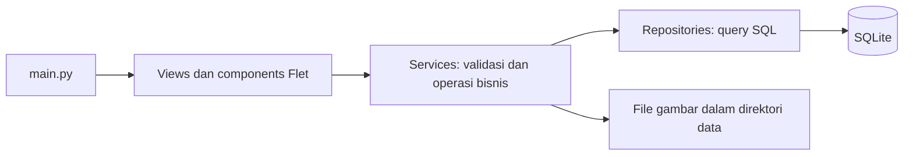

# DokumenUsaha

DokumenUsaha adalah aplikasi desktop Windows untuk administrasi usaha kecil di Indonesia. Aplikasi dikembangkan dengan Python, Flet, dan SQLite untuk penggunaan offline, satu pengguna, dan satu usaha per database.

Prioritas beta adalah invoice dengan item biasa untuk barang, jasa titip, dan pengiriman. **Halaman tersedia: Dashboard, Profil Usaha, Pelanggan, Katalog, Invoice, Penawaran, dan Pengaturan.** Alur invoice sudah mencakup draft, penerbitan, DP/cicilan/pelunasan, kwitansi, PDF offline, serta backup/restore ZIP. Panduan demo ada di [BETA_TEST.md](BETA_TEST.md).

Repository: [InsoniacX/ReceiptApp](https://github.com/InsoniacX/ReceiptApp).

## Daftar isi

- [Status implementasi](#status-implementasi)
- [Teknologi dan kebutuhan](#teknologi-dan-kebutuhan)
- [Instalasi dan menjalankan aplikasi](#instalasi-dan-menjalankan-aplikasi)
- [Penggunaan fitur](#penggunaan-fitur)
- [Struktur kode](#struktur-kode)
- [Arsitektur dan kontrak service](#arsitektur-dan-kontrak-service)
- [Database dan penyimpanan gambar](#database-dan-penyimpanan-gambar)
- [Pengujian](#pengujian)
- [Debugging dan pemecahan masalah](#debugging-dan-pemecahan-masalah)
- [Pengembangan berikutnya](#pengembangan-berikutnya)

## Status implementasi

Status berikut mengikuti implementasi yang tersedia melalui aplikasi.

| Bagian | Kemampuan yang tersedia |
| --- | --- |
| Database | Migrasi dengan checksum, transaksi atomik, constraint, index, trigger, dan pemulihan penggantian data yang terputus. |
| Profil dan gambar usaha | Identitas, kontak, rekening, logo, QRIS, tanda tangan, dan stempel. |
| Pelanggan dan katalog | Tambah/edit, cari, arsip/aktifkan kembali, paginasi, validasi harga dan SKU. |
| Penawaran | Draft, daftar, dan detail melalui UI; penerbitan/snapshot dan perubahan status melalui service. |
| Invoice | Draft langsung, penerbitan dengan konfirmasi dan snapshot, duplikasi sebagai draft, pembatalan dengan alasan, pencarian dan filter. |
| Pembayaran | DP, cicilan, pelunasan, riwayat, sisa tagihan, penolakan kelebihan bayar, pembatalan dengan alasan. |
| Kwitansi | Maksimal satu per pembayaran valid, nomor terpisah, snapshot dan terbilang; ikut dibatalkan saat pembayaran dibatalkan. |
| PDF offline | Simpan/buka invoice terbit dan kwitansi; snapshot identitas/gambar, saldo invoice terkini, nomor halaman. |
| Backup/restore | ZIP database dan seluruh assets, validasi manifest/checksum/schema/path, cadangan otomatis sebelum mengganti seluruh data. |
| Dashboard | Tagihan belum diterima, invoice jatuh tempo, draft, pembayaran bulan ini, daftar jatuh tempo dan pintasan. |

Aplikasi belum menyediakan login, sinkronisasi cloud, payment gateway, kasir/POS, persediaan barang, atau akuntansi.

## Teknologi dan kebutuhan

Lingkungan pengembangan lokal menggunakan Windows, PowerShell, Python **3.12.2**, dan SQLite **3.43.1** bawaan Python. Gunakan Python 3.12 untuk mengikuti lingkungan ini; kompatibilitas versi Python lain belum didokumentasikan sebagai hasil pengujian.

| Komponen | Versi pada lingkungan/requirements | Peran |
| --- | --- | --- |
| Python | 3.12.2 | Bahasa aplikasi. |
| Flet | 0.86.5 | Antarmuka desktop dan pemilih file. |
| SQLite / `sqlite3` | 3.43.1 lokal | Penyimpanan data, transaksi, dan migrasi. |
| Pillow | 12.3.0 | Membaca dan memvalidasi gambar. |
| platformdirs | 4.11.8 | Menentukan direktori data pengguna. |
| pytest | 9.1.1 | Pengujian otomatis. |
| ReportLab | 5.0.1 | Pembuatan PDF invoice dan kwitansi offline. |
| openpyxl | 3.1.5 | Dependensi yang disiapkan untuk Excel; fitur impor/ekspor belum dibuat. |

Daftar dependensi lengkap ada dalam `requirements.txt`. File tersebut merupakan snapshot lingkungan dan juga memuat paket web; aplikasi saat ini tidak memerlukan konfigurasi server web atau database terpisah. Instalasi dependensi dan penyiapan awal runtime desktop dapat membutuhkan internet.

## Instalasi dan menjalankan aplikasi

Semua perintah berikut dijalankan melalui PowerShell dari folder utama repository, yaitu folder yang memuat `main.py` dan `requirements.txt`.

### Instalasi baru

```powershell
git clone https://github.com/InsoniacX/ReceiptApp.git DokumenUsaha
Set-Location .\DokumenUsaha
py -3.12 -m venv venv
.\venv\Scripts\python.exe -m pip install -r requirements.txt
```

Jika repository dan `venv` sudah tersedia, gunakan lingkungan tersebut tanpa membuat ulang. Jika ingin mengikuti pekerjaan pada branch `development`, jalankan `git switch development` dari folder repository.

### Menjalankan aplikasi

```powershell
.\venv\Scripts\python.exe main.py
```

Pemanggilan interpreter secara langsung tidak membutuhkan aktivasi virtual environment. `main.py` menginisialisasi database, menerapkan migrasi yang belum dijalankan, lalu membangun halaman aplikasi, termasuk Dashboard dan Pengaturan. Halaman awal tetap Profil Usaha. Log dan detail kesalahan ditampilkan di terminal.

### Inisialisasi database secara terpisah

Untuk lokasi data pengguna bawaan:

```powershell
.\venv\Scripts\python.exe -m app.database
```

Untuk database pengembangan terpisah:

```powershell
.\venv\Scripts\python.exe -m app.database --path .\data\dokumenusaha.db
```

**Opsi `--path` hanya berlaku untuk perintah inisialisasi tersebut.** Perintah ini tidak mengubah database yang digunakan `main.py`; aplikasi tetap memakai lokasi bawaan. Belum ada pemilih database di UI atau argumen lokasi database pada `main.py`.

## Penggunaan fitur

### Profil usaha dan gambar

1. Buka halaman **Profil Usaha**.
2. Isi nama usaha yang wajib tersedia. Lengkapi alamat, kontak, NPWP, penanggung jawab, serta rekening sesuai kebutuhan.
3. Klik **Simpan Profil** sebelum menambahkan gambar.
4. Gunakan **Pilih & Simpan Logo**, **Pilih & Simpan QRIS**, **Pilih & Simpan Tanda Tangan**, atau **Pilih & Simpan Stempel**.
5. Setiap tombol gambar langsung menyimpan gambar yang dipilih. Saat aplikasi dibuka ulang, gambar dimuat dari penyimpanan aplikasi.

Gambar harus berformat PNG atau JPEG, berukuran maksimal **5 MiB (5 × 1024 × 1024 byte)**, dan memiliki maksimal **16.000.000 piksel**. Pemeriksaan memakai isi gambar, bukan hanya ekstensi file. Gambar QRIS merupakan aset yang diunggah pengguna; aplikasi belum memproses atau mengonfirmasi pembayaran QRIS.

### Pelanggan

Halaman **Pelanggan** menyediakan pelanggan perorangan (`PERSONAL`) atau perusahaan (`COMPANY`). Nama pelanggan/kontak wajib diisi; tersedia pula nama perusahaan, alamat, telepon, WhatsApp, email, NPWP, dan catatan.

- Klik **Tambah Pelanggan** untuk membuat data baru atau **Edit** untuk memperbaruinya.
- Cari berdasarkan nama, perusahaan, telepon, atau WhatsApp, lalu klik **Cari** atau tekan Enter.
- Gunakan **Sebelumnya** dan **Berikutnya** untuk berpindah halaman.
- Klik **Arsipkan** untuk menonaktifkan pelanggan tanpa menghapus datanya.
- Centang **Sertakan pelanggan diarsipkan** untuk melihat arsip dan menggunakan **Aktifkan Kembali**.

### Katalog

Halaman **Katalog** menyediakan tambah/edit item, pencarian, paginasi, arsip, dan aktivasi kembali. Harga default diisi dalam integer Rupiah.

### Invoice langsung

1. Tambahkan pelanggan aktif, lalu buka **Invoice → Tambah Invoice**.
2. Pilih pelanggan, tanggal invoice, dan jatuh tempo opsional.
3. Gunakan **Tambah dari Katalog** atau **Tambah Item Manual**. Setiap barang, jasa titip, dan pengiriman menjadi baris terpisah.
4. Harga ditulis tanpa pemisah ribuan, misalnya 150000. Kuantitas memakai koma dengan maksimal tiga angka desimal, misalnya 1,5.
5. Diskon dapat berupa nominal atau persentase; pajak opsional. Persentase maksimal dua angka desimal. Total dihitung otomatis.
6. Klik **Simpan Draft**, lalu gunakan **Lihat Detail** atau **Edit Draft**.

Draft belum bernomor resmi dan boleh belum memiliki item. Nama, deskripsi, satuan, dan harga item yang disimpan tetap dipertahankan ketika katalog berubah. Pelanggan atau item katalog yang diarsipkan harus diganti atau diaktifkan kembali sebelum draft disimpan. **Batal** mengabaikan perubahan form.

Contoh: Action Figure Rp150.000, Sepatu Gunung Rp450.000, Jasa Titip Rp100.000, dan Pengiriman Rp25.000 menghasilkan total Rp725.000. Tidak ada pengelompokan item atau konversi kurs otomatis.

### Penerbitan dan pembatalan invoice

Dari **Lihat Detail** draft, pilih **Terbitkan Invoice** lalu konfirmasi. Profil usaha, pelanggan aktif, minimal satu item, tanggal, jatuh tempo, dan total harus valid. Nomor resmi `INV-YYYY-NNNN` baru dialokasikan saat penerbitan. Nomor draft tetap terpisah.

Invoice terbit terkunci. Identitas usaha/pelanggan, item dan gambar disalin agar perubahan master tidak mengubah dokumen historis. **Duplikasi sebagai Draft** membuat draft baru dengan harga/item historis, tanpa nomor resmi dan tanpa referensi penawaran. Pelanggan harus masih aktif. **Batalkan Invoice** memerlukan alasan; invoice dengan pembayaran valid harus dibatalkan pembayarannya dahulu. Data historis tidak dihapus.

### Pembayaran dan kwitansi

1. Buka detail invoice terbit, lalu **Catat Pembayaran**.
2. Isi tanggal, nominal tanpa pemisah ribuan, metode (`CASH`, `TRANSFER`, `QRIS`, `OTHER`), serta referensi/catatan opsional.
3. Saldo berasal dari pembayaran valid. Nominal nol, negatif, pecahan, atau melebihi saldo ditolak.
4. Pilih **Buat Kwitansi** pada pembayaran. Kwitansi memakai counter terpisah dengan awalan `RCPT`, sesuai schema existing. Klik berikutnya membuka kwitansi yang sama.
5. **Batalkan Pembayaran** memerlukan alasan dan konfirmasi. Saldo bertambah kembali; kwitansi terkait ikut berstatus dibatalkan.

Kwitansi merekam satu pembayaran, bukan seluruh total invoice. PDF kwitansi yang dibatalkan menampilkan label **DIBATALKAN**. Berkas PDF yang sudah dikirim sebelumnya tidak berubah otomatis; kirim ulang versi pembatalannya bila diperlukan.

### PDF offline

Pada detail invoice terbit atau kwitansi, pilih **Simpan PDF** untuk menentukan tujuan, atau **Buka PDF** untuk membuka hasil dengan aplikasi PDF bawaan Windows. Buka PDF menyimpan salinan di folder `exports/` dalam direktori data.

Identitas, item, dan gambar berasal dari snapshot. Saldo/status pembayaran invoice dihitung saat PDF dibuat, sehingga PDF setelah pelunasan menampilkan saldo terbaru. Logo/QRIS/tanda tangan/stempel boleh tidak diisi. Referensi gambar yang ada tetapi filenya hilang atau rusak menghasilkan pesan kesalahan.

Font PDF bawaan mendukung tulisan Latin/Indonesia, tetapi tidak semua aksara Jepang atau emoji. Karakter yang tidak didukung ditolak agar tidak hilang diam-diam. API lama `build_invoice_pdf(..., font_path=...)` mendukung TTF kustom untuk invoice; pemilihan font lewat UI dan font kwitansi kustom belum tersedia.

### Backup dan restore

Buka **Pengaturan → Buat Cadangan Sekarang**, pilih folder, lalu simpan ZIP di media lain. Paket berisi `manifest.json`, `database.sqlite3`, dan `assets/`, termasuk gambar snapshot dokumen. Manifest mencatat versi format/aplikasi/schema, waktu, ukuran dan SHA-256 setiap file. PDF ekspor dan arsip backup lama tidak disertakan.

**Pulihkan dari Cadangan mengganti SEMUA data dan gambar lokal, bukan menggabungkan data dua perangkat.** Pilih ZIP dan setujui dialog konfirmasi. Aplikasi mengekstrak serta memvalidasi paket sebelum penggantian, menunggu koneksi aplikasinya selesai, dan membuat ZIP `backups/before-restore-<id>.zip`. Penggantian memakai jurnal pemulihan agar kegagalan dapat mengembalikan data sebelumnya; startup memeriksa jurnal yang tertinggal. Form/halaman dimuat ulang setelah berhasil.

Tutup instance aplikasi lain atau alat database sebelum restore. Cadangan yang didukung harus memiliki schema/migrasi yang sama dengan versi aplikasi ini, tanpa objek schema tambahan. Batas saat ini: 256 MiB per file, 1 GiB total isi, maksimal 10.000 file data. Cadangan tidak dienkripsi; checksum memeriksa keutuhan, bukan membuktikan siapa pembuatnya.

**Buka Lokasi Data** membuka folder database, gambar, hasil PDF, dan backup otomatis. Saat berpindah perangkat, pilih satu salinan sebagai sumber; perubahan terpisah pada perangkat penerima akan diganti.

### Dashboard dan filter

Dashboard membaca saldo dari `invoice_balances`, menghitung pembayaran valid pada bulan kalender berjalan, dan menampilkan maksimal 20 invoice belum lunas dengan jatuh tempo sampai tujuh hari ke depan. Angka uang dijumlahkan sebagai integer. Tersedia pintasan **Buat Invoice**, **Tambah Pelanggan**, dan **Catat Pembayaran**.

Daftar invoice mendukung pencarian nomor/nama pelanggan, status dokumen, tanggal invoice awal/akhir (inklusif), dan status pembayaran. Format tanggal adalah `YYYY-MM-DD`. Filter pembayaran hanya menampilkan invoice terbit; hapus filter tersebut untuk mencari draft/batal.

### Penawaran

Halaman **Penawaran** menyediakan tambah/edit draft, daftar, pencarian, filter status, dan detail. Form item memakai komponen bersama dengan Invoice. Invoice langsung tidak memerlukan penawaran.

## Struktur kode

```text
DokumenUsaha/
├── main.py                         # Titik masuk dan navigasi Flet
├── requirements.txt                # Snapshot dependensi
├── README.md                       # Panduan codebase saat ini
├── .gitignore                      # Pengecualian file lokal dari Git
├── app/
│   ├── config/
│   │   └── paths.py                # Lokasi database bawaan
│   ├── database/
│   │   ├── __init__.py             # Ekspor API database
│   │   ├── __main__.py             # CLI inisialisasi database
│   │   ├── database.py             # Koneksi, transaksi, dan migrasi
│   │   ├── maintenance.py          # Koordinasi koneksi saat backup/restore
│   │   └── migrations/
│   │       └── 001_initial_schema.sql
│   ├── repositories/
│   │   ├── business_profile_repository.py
│   │   ├── customer_repository.py
│   │   ├── catalog_repository.py
│   │   ├── quotation_repository.py
│   │   ├── invoice_repository.py
│   │   ├── document_number_repository.py
│   │   ├── payment_repository.py
│   │   ├── receipt_repository.py
│   │   ├── backup_repository.py
│   │   ├── dashboard_repository.py
│   │   └── document_repository.py
│   ├── services/
│   │   ├── business_profile_service.py
│   │   ├── business_image_service.py
│   │   ├── business_logo_service.py
│   │   ├── customer_service.py
│   │   ├── catalog_service.py
│   │   ├── quotation_service.py
│   │   ├── invoice_service.py
│   │   ├── document_calculator.py
│   │   ├── document_number_service.py
│   │   ├── document_asset_service.py
│   │   ├── payment_service.py
│   │   ├── receipt_service.py
│   │   ├── invoice_pdf_service.py
│   │   ├── document_pdf_service.py
│   │   ├── backup_service.py
│   │   └── dashboard_service.py
│   ├── components/
│   │   ├── business_logo.py         # Pemilih dan pratinjau logo
│   │   ├── business_image.py        # Pemilih QRIS/tanda tangan/stempel
│   │   └── document_pdf_actions.py  # Simpan/buka PDF
│   └── views/
│       ├── business_profile_view.py
│       ├── customer_view.py
│       ├── catalog_view.py
│       ├── quotation_view.py
│       ├── quotation_editor.py
│       ├── invoice_view.py
│       ├── invoice_editor.py
│       ├── document_editor.py       # Form item bersama
│       ├── payment_panel.py         # Pembayaran dan detail kwitansi
│       ├── dashboard_view.py
│       └── settings_view.py
└── tests/
    ├── test_database.py
    ├── test_business_profile.py
    ├── test_customer_service.py
    ├── test_catalog_service.py
    ├── test_document_*.py
    ├── test_quotation_*.py
    ├── test_invoice_service.py
    ├── test_invoice_views.py
    └── test_view_interactions.py
```

File `__init__.py` lain menandai paket Python. Folder `venv`, cache, database lokal, dan konfigurasi `.vscode` diabaikan oleh Git.

Pada workspace lokal juga terdapat `docs/PROJECT_CONTEXT.md`, `docs/DATABASE_DESIGN.md`, dan `check_business_profile.py`. Saat dokumentasi ini disusun, ketiganya belum dilacak Git sehingga belum tentu tersedia pada hasil clone. Dokumen `docs/` mencatat keputusan awal dan memiliki keterangan status lama; status implementasi dalam README ini mengikuti kode sekarang. Skrip `check_business_profile.py` adalah pemeriksaan manual repository profil dengan database sementara, bukan titik masuk aplikasi atau bagian dari penemuan tes pytest otomatis.

## Arsitektur dan kontrak service


```mermaid
flowchart LR
    M[main.py] --> V[Views dan components Flet]
    V --> S[Services: validasi dan operasi bisnis]
    S --> R[Repositories: query SQL]
    R --> D[(SQLite)]
    S --> I[File gambar dalam direktori data]
```

Views menangani input, navigasi, dan pesan pengguna. Services memvalidasi data dan mengatur transaksi; repositories membaca atau menulis database. Komponen gambar menggunakan service gambar bersama, sedangkan `business_logo_service.py` menyediakan pembungkus khusus jenis `logo`.

| Modul service | Fungsi publik | Kontrak utama |
| --- | --- | --- |
| `business_profile_service` | `get_business_profile`, `save_business_profile` | Satu profil; nama wajib; pembaruan sebagian mempertahankan field lain. Pembacaan mengembalikan `None` jika profil belum ada. |
| `customer_service` | `get_customer`, `list_customers`, `create_customer`, `update_customer`, `set_customer_active` | Validasi tipe pelanggan, ID, nama, pencarian, dan paginasi; arsip melalui status aktif. |
| `catalog_service` | `get_item`, `list_items`, `create_item`, `update_item`, `set_item_active` | Validasi produk/jasa, nama, satuan, harga integer, SKU unik, dan paginasi. |
| `invoice_service` | `create_draft`, `get_invoice`, `update_draft`, `list_invoices`, `publish_invoice`, `duplicate_as_draft`, `cancel_invoice` | Invoice langsung. Header, item, dan event disimpan atomik; hanya draft tanpa nomor yang dapat diedit. Pembaruan sebagian mempertahankan data dan harga sebelumnya. |
| `business_image_service` | `save_business_image`, `load_business_image` | Menerima lokasi database dan jenis gambar; hasil berupa bytes gambar, atau `None` saat belum ada gambar. |
| `business_logo_service` | `save_business_logo`, `load_business_logo` | Meneruskan operasi logo ke service gambar bersama. |

API tambahan:

| Modul | API dan kontrak |
| --- | --- |
| `payment_service` | `create_payment` (alias `record_payment`), `get_payment`, `list_payments`, `void_payment`, `get_invoice_summary`. Pencatatan menerima `request_id` UUID untuk mencegah duplikasi retry. |
| `receipt_service` | `issue_receipt(connection, payment_id)`, `get_receipt`, `get_by_payment`, `terbilang`. Penerbitan berulang mengembalikan kwitansi yang sudah ada. |
| `document_pdf_service` | `generate_invoice_pdf(connection, invoice_id, output_path)` dan `generate_receipt_pdf(connection, receipt_id, output_path)` mengembalikan Path hasil; penggantian file atomik. |
| `backup_service` | `create_backup(database_path, output_path)` dan `restore_backup(database_path, archive_path)`. Restore mengembalikan lokasi cadangan sebelum pemulihan. Jangan memanggil sambil menahan koneksi aktif. |
| `dashboard_service` | `get_dashboard(connection)` membaca ringkasan tanpa tabel agregat baru. |

Aturan yang perlu dipertahankan saat menambah kode:

- Service profil, pelanggan, dan katalog menerima koneksi SQLite. Pemanggil bertanggung jawab menutup koneksi; UI menggunakan `contextlib.closing`.
- Service gambar menerima path database dan mengelola koneksinya sendiri.
- Operasi tulis service menggunakan `transaction()`. Jangan membungkusnya lagi dengan transaksi pada koneksi yang sama karena transaksi bersarang ditolak.
- Kesalahan input menggunakan `ProfileValidationError`, `CustomerValidationError`, `CatalogValidationError`, atau `BusinessImageValidationError`. Data pelanggan/katalog yang tidak ditemukan menggunakan `CustomerNotFoundError` atau `CatalogItemNotFoundError`.
- Harga katalog harus berupa integer Rupiah dari 0 sampai `2**63 - 1`; boolean, float, dan string angka ditolak.
- SKU dibersihkan dan diubah menjadi huruf besar. SKU kosong menjadi `None`; SKU milik item yang diarsipkan tetap dianggap terpakai.
- Daftar pelanggan/katalog menerima `limit` 1–100 dan `offset` nonnegatif. Data arsip tidak disertakan kecuali `include_archived=True`.
- Tambahkan operasi bisnis ke service dan query SQL ke repository agar UI tetap berfokus pada interaksi pengguna.

## Database dan penyimpanan gambar

### Lokasi data

Lokasi bawaan ditentukan oleh `platformdirs` melalui `default_database_path()`. Pada Windows umumnya:

```text
%LOCALAPPDATA%\DokumenUsaha\
├── dokumenusaha.db
└── assets\
    ├── logos\
    ├── qris\
    ├── signatures\
    └── stamps\
```

Untuk melihat path aktual tanpa menginisialisasi database:

```powershell
.\venv\Scripts\python.exe -c "from app.config.paths import default_database_path; print(default_database_path())"
```

Gambar disalin ke subfolder `assets` di sebelah database dengan nama UUID. Database menyimpan path relatif, misalnya `assets/logos/<uuid>.png`. Folder ini berbeda dari folder aset tampilan Flet di repository. Pembacaan gambar memeriksa bahwa file berada dalam folder jenis gambar yang sesuai.

Mengganti gambar membuat file baru; pembersihan otomatis gambar lama belum tersedia. Gunakan backup/restore melalui Pengaturan untuk menyalin database beserta gambar. Jika membuat salinan data secara manual, tutup aplikasi dan proses lain yang menggunakan database terlebih dahulu, lalu salin direktori data beserta gambar, bukan hanya file `.db`.

### Struktur database

Terdapat 12 tabel bisnis, satu tabel teknis migrasi, dan satu view saldo.

| Tabel/view | Tanggung jawab |
| --- | --- |
| `business_profile` | Identitas usaha dan path empat jenis gambar; hanya ID 1. |
| `customers` | Data pelanggan dan status aktif. |
| `catalog_items` | Produk/jasa, SKU, harga default, satuan, dan status aktif. |
| `quotations`, `quotation_items` | Penawaran beserta baris item dan salinan data historis. |
| `invoices`, `invoice_items` | Invoice beserta baris item dan referensi penawaran opsional. |
| `payments` | Pembayaran invoice, metode, dan status `VALID`/`VOID`. |
| `receipts` | Kwitansi; maksimal satu per pembayaran. |
| `document_sequences` | Counter nomor penawaran, invoice, dan kwitansi. |
| `document_events` | Riwayat dokumen yang hanya dapat ditambah. |
| `app_settings` | Pengaturan berupa JSON. |
| `schema_migrations` | Versi, nama file, checksum, dan waktu penerapan migrasi. |
| `invoice_balances` | View total pembayaran valid, sisa tagihan, pelunasan, dan keterlambatan. |

Schema menggunakan tabel `STRICT`, foreign key, dan trigger untuk menjaga aturan dokumen. Nominal menggunakan integer Rupiah; kuantitas dokumen memakai `quantity_milli` berskala 1.000, dan persentase memakai basis point (100 = 1%). Saldo invoice dihitung dari pembayaran valid, bukan disimpan ulang sebagai angka yang diedit manual.

Constraint dan trigger sudah mencakup pembatasan pembayaran berlebih, penguncian dokumen terbit, nomor unik, serta pembatalan pembayaran/kwitansi. Kalkulasi, penomoran, dan snapshot/penerbitan penawaran sudah tersedia melalui service. Penerbitan invoice, pembayaran, dan kwitansi sudah terhubung ke UI. Tahap ini menggunakan schema existing; tidak ada migration baru atau perubahan pada `001_initial_schema.sql`. Lihat `app/database/migrations/001_initial_schema.sql` untuk definisi fisiknya.

### Migrasi dan transaksi

- `initialize_database()` membuat direktori tujuan dan menerapkan migrasi yang belum dijalankan.
- File migrasi berurutan mulai `001`, dengan pola seperti `002_nama_perubahan.sql`.
- Checksum SHA-256 mendeteksi perubahan migrasi yang sudah diterapkan. Buat migrasi baru untuk perubahan schema berikutnya.
- Database dengan versi migrasi lebih baru daripada kode aplikasi ditolak.
- Satu batch migrasi dijalankan secara atomik dalam transaksi; kegagalan membatalkan batch tersebut.
- `connect()` mengaktifkan foreign key, menggunakan `sqlite3.Row`, dan menetapkan timeout lock 5 detik.
- `transaction()` menggunakan `BEGIN IMMEDIATE`, melakukan commit jika berhasil, dan rollback jika gagal.

## Pengujian

Jalankan seluruh suite dari folder utama repository:

```powershell
.\venv\Scripts\python.exe -m pytest -q
```

Untuk fokus pada salah satu modul:

```powershell
.\venv\Scripts\python.exe -m pytest tests/test_catalog_service.py -q
```

| File tes | Cakupan |
| --- | --- |
| `test_database.py` | Migrasi, rollback, checksum, constraint/FK, saldo, pembayaran, kwitansi, dan penguncian dokumen. |
| `test_business_profile.py` | Validasi profil, normalisasi input, pembaruan sebagian, dan mempertahankan data saat input salah. |
| `test_customer_service.py` | Pembuatan pelanggan, validasi, pembaruan, pencarian, arsip, dan data tidak ditemukan. |
| `test_catalog_service.py` | Produk/jasa, harga, SKU, pencarian, pembaruan sebagian, rollback, arsip, dan batas paginasi. |
| `test_document_calculator.py`, `test_document_number.py` | Perhitungan, pembulatan, penomoran, dan rollback. |
| `test_quotation_edit.py`, `test_quotation_publish.py`, `test_quotation_status.py` | Draft, penerbitan/snapshot, status, dan daftar penawaran. |
| `test_invoice_service.py` | Draft langsung, item jastip, validasi, rollback, harga historis, penguncian, dan daftar invoice. |
| `test_view_interactions.py`, `test_invoice_views.py` | Form, navigasi, total, paginasi, arsip, dan penanganan kesalahan melalui handler Flet. |

Tes menggunakan database sementara melalui fixture pytest. Tes interaksi memanggil handler Flet tanpa membuka jendela desktop; pengujian visual tetap diperlukan pada perangkat nyata. Tes tambahan mencakup penerbitan, pembayaran, kwitansi, PDF, backup/restore (termasuk rollback saat penggantian gagal), dashboard dan integrasi UI. Pengujian ini tidak menggantikan pemeriksaan dialog file serta aplikasi pembaca PDF pada Windows nyata.

Pemeriksaan manual UI yang relevan: simpan profil, unggah setiap jenis gambar, tutup dan buka aplikasi untuk memeriksa pemuatan ulang, lalu coba tambah/edit/cari/arsip/aktifkan kembali pelanggan. Jumlah tes yang lulus sebaiknya dibaca dari hasil eksekusi terbaru; README ini tidak menetapkan angka kelulusan permanen.

## Debugging dan pemecahan masalah

Untuk VS Code, buka folder utama repository dan pilih interpreter `venv\Scripts\python.exe`. Jika menggunakan konfigurasi debugging lokal, arahkan aplikasi ke `main.py` dan tes ke modul `pytest`. Contoh isi `.vscode/launch.json`:

```json
{
    "version": "0.2.0",
    "configurations": [
        {
            "name": "Debug Aplikasi",
            "type": "debugpy",
            "request": "launch",
            "program": "${workspaceFolder}/main.py",
            "python": "${workspaceFolder}/venv/Scripts/python.exe",
            "cwd": "${workspaceFolder}",
            "console": "integratedTerminal"
        },
        {
            "name": "Debug Tes Katalog",
            "type": "debugpy",
            "request": "launch",
            "module": "pytest",
            "args": ["tests/test_catalog_service.py", "-q"],
            "python": "${workspaceFolder}/venv/Scripts/python.exe",
            "cwd": "${workspaceFolder}",
            "console": "integratedTerminal"
        }
    ]
}
```

Folder `.vscode/` diabaikan oleh Git; konfigurasi tersebut bersifat lokal dan memerlukan ekstensi Python Debugger pada VS Code.

| Gejala | Pemeriksaan atau tindakan |
| --- | --- |
| `ModuleNotFoundError: No module named 'app'` saat mengetes | Jalankan `python -m pytest` menggunakan interpreter `venv` dari folder utama; gunakan konfigurasi modul pytest ketika debugging. |
| `SyntaxError` menunjuk `.gitignore` | Debugger menjalankan file aktif yang bukan Python. Pilih konfigurasi `Debug Aplikasi` atau `Debug Tes Katalog`. |
| Debugger berhenti pada exception yang memang diuji | Opsi `Raised Exceptions` dapat menghentikan eksekusi sebelum `pytest.raises` menangkap exception; nonaktifkan opsi itu bila tidak diperlukan. |
| Gambar belum bisa disimpan | Simpan profil dahulu, lalu periksa format, ukuran, resolusi, dan keterbacaan file. |
| Gambar tersimpan tidak ditemukan | Periksa direktori data beserta `assets`; pilih ulang gambar jika salinannya hilang. |
| Invoice belum bernomor atau tombol PDF tidak terlihat | Buka detail draft dan terbitkan dahulu. PDF invoice tersedia setelah status Terbit. |
| PDF menolak karakter | Font bawaan tidak mendukung semua aksara; lihat batas font pada bagian PDF offline. |
| Restore ditolak | Periksa pesan validasi, gunakan ZIP lengkap dari versi schema yang sama, dan tutup operasi/instance lain. Data aktif tidak diganti jika validasi gagal. |
| `Applied migration has changed` | Cocokkan kembali file migrasi dengan versi yang diterapkan; perubahan schema baru harus masuk migrasi berikutnya. |
| `database is locked` | Pastikan tidak ada proses lain menahan transaksi tulis pada database yang sama, lalu coba kembali. |

## Pengembangan berikutnya

Pekerjaan berikutnya sebelum distribusi beta:

1. Jalankan skenario pada [BETA_TEST.md](BETA_TEST.md) di Windows nyata, termasuk dialog file, pembaca PDF, restart, dan restore.
2. Buat serta uji paket/installer Windows pada mesin bersih, kemudian lakukan pilot terbatas sebelum memperluas ke 10 perusahaan.
3. Evaluasi build Android dan kesiapan build/signing iPhone secara terpisah. Integrasi buka file/lokasi data saat ini memakai Windows; belum diklaim kompatibel ponsel.
4. Tambahkan dukungan font Jepang dan pemilihan font bila dibutuhkan pengguna jastip.

Aplikasi tetap memakai SQLite lokal tanpa server. Pengguna menentukan harga dan biaya sendiri. Penggabungan data dua arah, impor CSV/Excel, pengelompokan item, kurs otomatis, Delivery Order, Purchase Order, RAB, multi-user, cloud, dan integrasi pembayaran tidak termasuk tahap ini.
